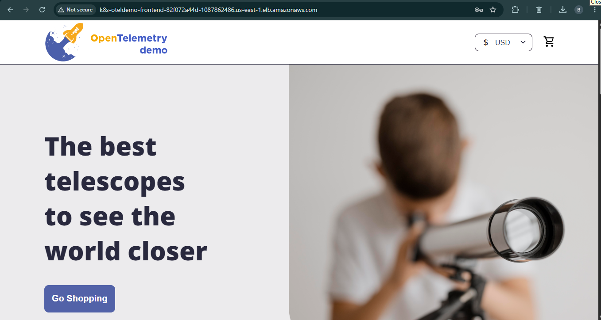
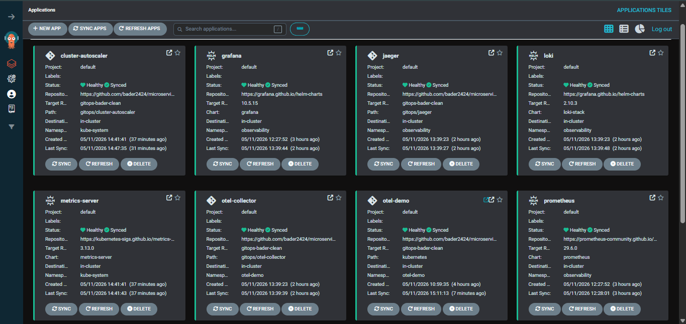
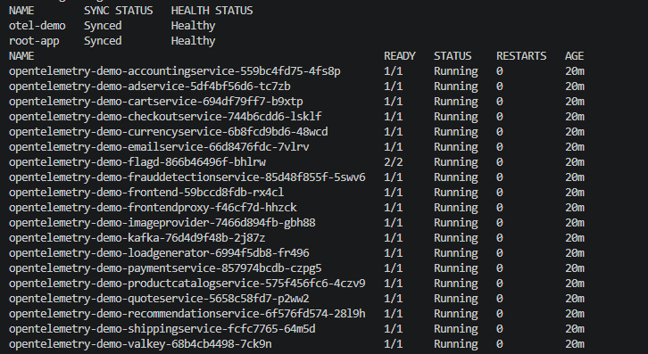

# Microservice DevOps Portfolio

A production-style DevOps portfolio project based on the OpenTelemetry Astronomy Shop demo.

This repository shows how a real microservice application can be containerized, deployed to AWS EKS, delivered with GitOps, secured with CI/CD checks, and monitored with observability tooling.

The original application is based on the open-source OpenTelemetry demo. I extended it with Terraform, AWS EKS, Kubernetes manifests, Argo CD, GitHub Actions, DevSecOps scanning, autoscaling, and cloud monitoring.

## Highlights

- Provisioned AWS infrastructure with Terraform
- Deployed the full microservice application to Amazon EKS
- Managed Kubernetes delivery with Argo CD GitOps
- Exposed the app through an AWS Application Load Balancer
- Added CI/CD automation with GitHub Actions and GHCR
- Added DevSecOps checks with Trivy, Checkov, Gitleaks, and kubeconform
- Added observability with Prometheus, Grafana, Loki, Jaeger, OpenTelemetry Collector, and CloudWatch
- Added HPA and Cluster Autoscaler configuration
- Included cleanup and cost-awareness practices for AWS environments

## Architecture

```text
Developer
  -> GitHub
  -> GitHub Actions
  -> GitHub Container Registry
  -> GitOps manifest update
  -> Argo CD
  -> AWS EKS
  -> Kubernetes workloads
  -> AWS Application Load Balancer
  -> OpenTelemetry Demo application
```

Runtime traffic:

```text
User -> AWS ALB -> Kubernetes Ingress -> frontend-proxy -> frontend -> backend microservices
```

Observability flow:

```text
Application telemetry -> OpenTelemetry Collector -> Jaeger
Kubernetes metrics -> Prometheus -> Grafana
Pod logs -> Promtail -> Loki -> Grafana
Cluster metrics/logs -> AWS CloudWatch
```

## Tech Stack

| Area | Tools |
|---|---|
| Application | OpenTelemetry Astronomy Shop microservices |
| Containers | Docker, Docker Compose |
| Cloud | AWS, EKS, EC2, VPC, ALB, IAM, ECR, CloudWatch |
| IaC | Terraform |
| Kubernetes | Deployments, Services, Ingress, HPA, ServiceAccounts |
| GitOps | Argo CD app-of-apps |
| CI/CD | GitHub Actions, GHCR |
| Security | Trivy, Checkov, Gitleaks, kubeconform |
| Observability | Prometheus, Grafana, Loki, Jaeger, OpenTelemetry Collector |
| Scaling | HPA, Cluster Autoscaler |

## Screenshots

### Application Running on AWS



### Argo CD GitOps Applications



### Kubernetes Workloads



## Repository Structure

```text
.github/workflows/      GitHub Actions CI/CD and DevSecOps workflows
infra/terraform/        AWS infrastructure as code
gitops/                 Argo CD root app and platform applications
kubernetes/             Kubernetes manifests for the microservices
src/                    Application source code and Dockerfiles
scripts/                Helper scripts
docs/images/            Project screenshots
docker-compose.yml      Local full-stack deployment
```

## Run Locally

Requirements:

- Docker
- Docker Compose

```bash
git clone https://github.com/bader2424/microservice-devops-portfolio.git
cd microservice-devops-portfolio
docker compose up --force-recreate --remove-orphans --detach
```

Local URLs:

```text
Application: http://localhost:8080
Grafana:     http://localhost:8080/grafana
Jaeger:      http://localhost:8080/jaeger/ui
```

Stop the local environment:

```bash
docker compose down --remove-orphans
```

## AWS EKS Deployment

This project was deployed to AWS EKS using Terraform for infrastructure provisioning and Argo CD for GitOps delivery.

High-level deployment flow:

```text
Terraform -> EKS -> Argo CD -> GitOps root app -> Platform apps + microservices
```

Main commands:

```bash
cd infra/terraform
terraform init
terraform validate
terraform plan -out tfplan
terraform apply tfplan

aws eks update-kubeconfig --region us-east-1 --name bader-gitops-otel-demo-dev

kubectl apply -f gitops/root-app.yaml
kubectl get applications -n argocd
kubectl get pods -n otel-demo
kubectl get ingress -n otel-demo
```

The public application endpoint is exposed through the AWS Application Load Balancer created by the Kubernetes Ingress.

## CI/CD and DevSecOps

The repository includes GitHub Actions workflows for build validation, security scanning, image publishing, and GitOps-based deployment.

Pipeline flow:

```text
Code change
  -> GitHub Actions
  -> Build container image
  -> Run security scans
  -> Push image to GHCR
  -> Update Kubernetes manifest
  -> Argo CD syncs change to EKS
```

Included checks:

- Go checks and test validation
- Docker image build validation
- Kubernetes manifest validation
- Terraform validation
- Trivy vulnerability scanning
- Gitleaks secret scanning
- Checkov infrastructure scanning

## Observability

The project includes a full observability stack for metrics, logs, traces, and cloud-native monitoring.

- Prometheus for metrics
- Grafana for dashboards
- Loki and Promtail for logs
- Jaeger for distributed tracing
- OpenTelemetry Collector for telemetry routing
- AWS CloudWatch Container Insights for EKS visibility

## Cleanup

AWS resources can generate cost. Destroy the environment when testing is finished:

```bash
cd infra/terraform
terraform destroy
```

After cleanup, confirm that load balancers, NAT gateways, EBS volumes, ECR images, and CloudWatch log groups are removed if no longer needed.

## Project Status

This is a portfolio project built to demonstrate practical DevOps and cloud engineering skills across AWS infrastructure, Kubernetes, GitOps, CI/CD, security scanning, observability, autoscaling, and cloud cost awareness.

## Attribution

The application source is based on the OpenTelemetry Astronomy Shop demo.

The DevOps platform work in this repository, including AWS infrastructure, Terraform configuration, Kubernetes deployment structure, GitOps setup, CI/CD workflows, security scanning, observability integration, and cleanup practices, was added as part of this portfolio project.
